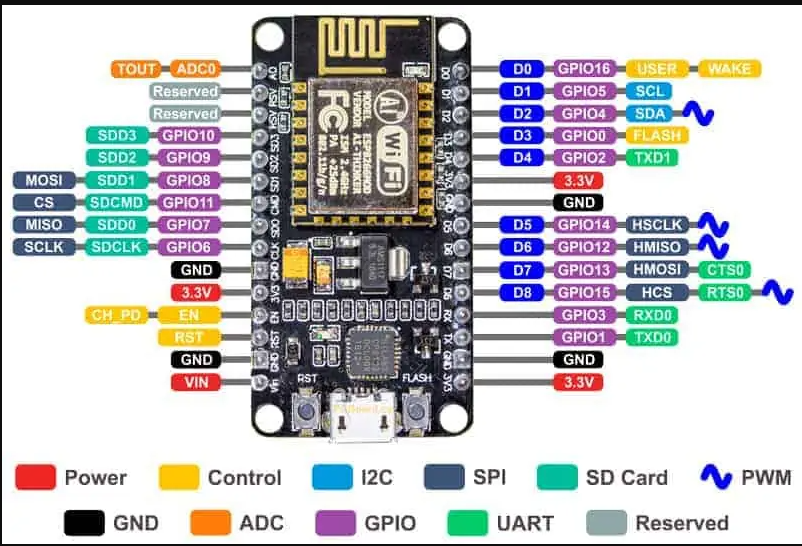

# 24CYS333 - Internet of Things
  
 
    

## Boards and Hardware Kits

### Arduino
_Source:_ [Different Types of Arduino Boards: Their Uses and Features](https://playwithcircuit.com/different-types-of-arduino-boards-their-uses-and-features/)

  

### Raspberry Pi &^Pin Diagram

   

### NodeMCU with Pin Diagram

  

### Comparison of NodeMCU, Raspberry Pi, and Arduino

| **Parameter**               | **NodeMCU**                           | **Raspberry Pi**                          | **Arduino**                              |
|-----------------------------|---------------------------------------|------------------------------------------|-----------------------------------------|
| **Processor**               | ESP8266 (Tensilica Xtensa LX106, 80 MHz) | ARM Cortex-A (Broadcom, varies by model) | ATmega328/ATmega2560 (8-bit AVR)        |
| **Clock Speed**             | 80 MHz                                | 700 MHz – 1.8 GHz                        | 16 MHz                                  |
| **Memory (RAM)**            | 128 KB                                | 512 MB – 8 GB                            | 2 KB – 8 KB                             |
| **Storage**                 | 4 MB Flash                           | SD Card (expandable)                     | No built-in storage; requires EEPROM or external modules |
| **Operating System**        | None                                  | Linux-based OS (e.g., Raspbian)          | None                                    |
| **Connectivity**            | Built-in Wi-Fi                       | Ethernet, Wi-Fi, Bluetooth (varies by model) | Requires external modules for Wi-Fi/Bluetooth |
| **Power Consumption**       | ~170 mA (at 3.3V)                    | ~300 mA to 3 A (depending on model)      | ~50 mA (at 5V)                          |
| **GPIO Pins**               | 11 Digital + 1 Analog                                  | 26–40                                   | ~14–54                          |
| **Programming Language**    | Lua, C++ (Arduino IDE support)       | Python, C++, Java, Scratch, etc.         | C++ (Arduino IDE)                       |
| **Ease of Programming**     | Easy (Arduino IDE or NodeMCU Firmware) | Moderate (requires OS setup and libraries) | Easy (Arduino IDE)                      |
| **Sensors and Peripherals** | Supports many I2C, SPI sensors       | Supports USB devices, HDMI output, sensors | Supports I2C, SPI sensors              |
| **Processing Power**        | Moderate (suitable for IoT tasks)    | High (suitable for multitasking)         | Low (suitable for simple tasks)         |
| **Real-Time Performance**   | No real-time OS                      | No real-time OS                          | Real-time performance                   |
| **Multitasking**            | No                                  | Yes (supports multiprocessing)           | No                                      |
| **Expandability**           | Limited                              | High (supports USB, external drives)     | Limited                                 |
| **Power Supply**            | 3.3V                                | 5V (via micro USB/Type-C)                | 5V (via USB or barrel jack)             |
| **Debugging**               | Limited                              | Advanced debugging tools                 | Limited                                 |
| **Applications**            | IoT, Home Automation, Wi-Fi Projects | Robotics, multimedia, server applications | Basic robotics, sensor data collection  |
| **Usage Scenarios**         | Ideal for Wi-Fi-enabled IoT Projects | Ideal for complex tasks needing high processing power | Ideal for beginner-level projects requiring simplicity |
| **Community Support**       | Moderate                            | High                                     | Very High                               |
| **Cost (INR)**              | ₹300–₹800                            | ₹3,000–₹10,000                           | ₹600–₹2,000                             |
| Variants                    | NA                                  | - Raspberry Pi 1 Model B   - Raspberry Pi 2 Model B   - Raspberry Pi 3 Model B   - Raspberry Pi 3 Model B+   - Raspberry Pi 4 Model B   - Raspberry Pi Zero W   - Raspberry Pi Zero 2 W   - Raspberry Pi Pico | - Arduino Uno R3   - Arduino Mega 2560   - Arduino Nano   - Arduino Leonardo   - Arduino Due   - Arduino Nano Every   - Arduino Pro Mini   - Arduino MKR1000   - Arduino Portenta H7 | 
