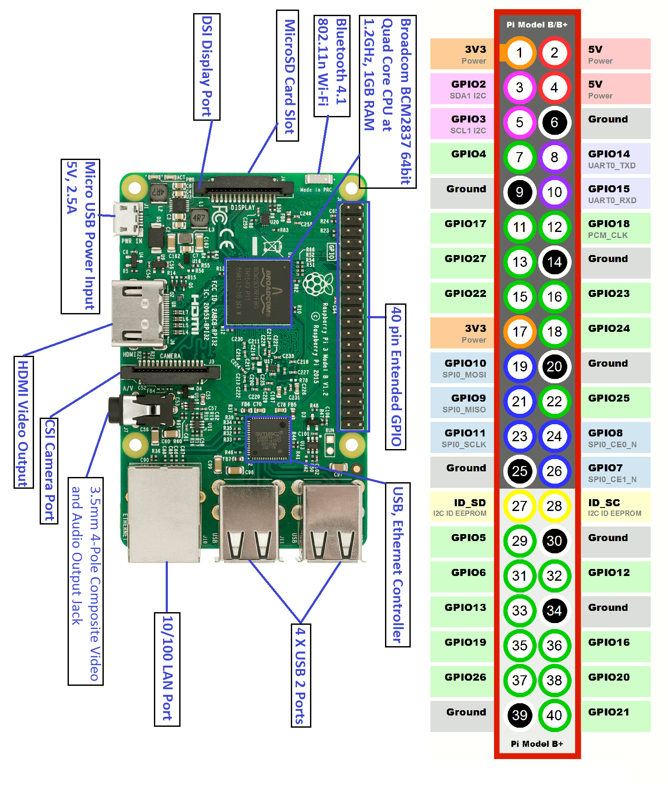
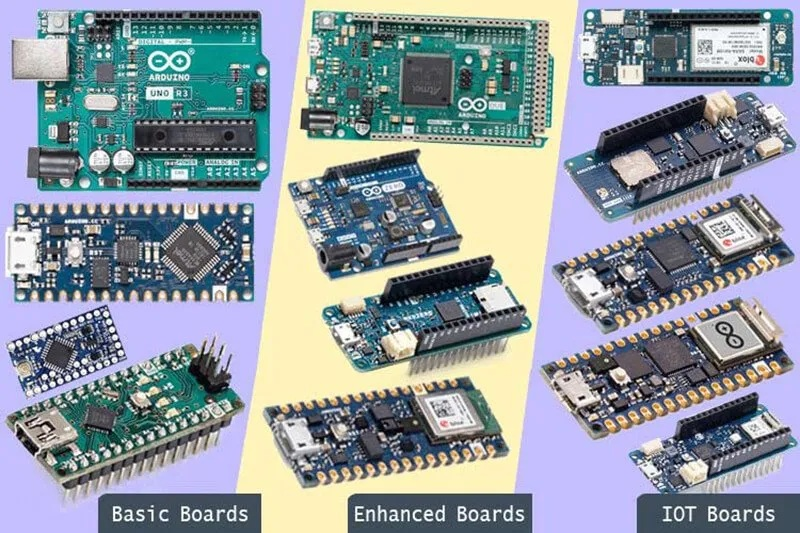

# 24CYS333 - Internet of Things
  
 
    

## Raspberry Pi

  

### Pin Diagram

  

## Arduino
_Source:_ [Different Types of Arduino Boards: Their Uses and Features](https://playwithcircuit.com/different-types-of-arduino-boards-their-uses-and-features/)

  

