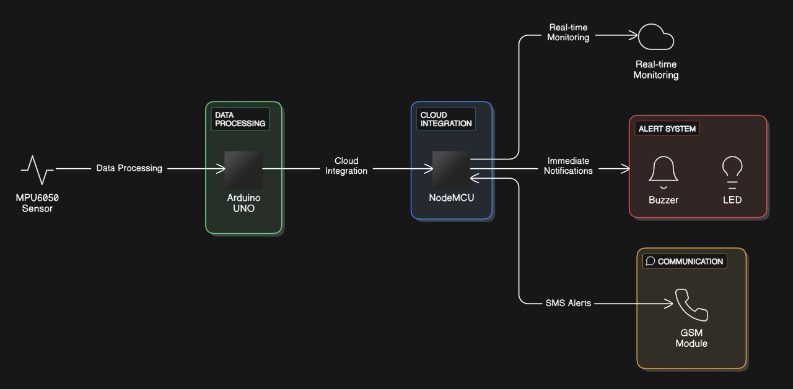

# 24CYS333 - Internet of Things
  
 
    

## IoT#11 - IoT-Based Comprehensive Elderly Monitoring System with Integrated Fall Detection and Emergency Alert Mechanism

      
    

---

### Problem Statement
Elderly individuals face heightened risks of falls and medical emergencies due to age-related health issues, reduced mobility, and chronic conditions. Timely assistance is critical, yet traditional systems fail to provide real-time monitoring and effective emergency responses, especially in independent living scenarios.

---

### Proposed Solution

The proposed **IoT-Based Comprehensive Elderly Monitoring System** incorporates real-time monitoring, fall detection, and emergency alert mechanisms, ensuring enhanced safety for elderly individuals. Key features include:

1. **Fall Detection:** Leveraging the MPU 6050 accelerometer and gyroscope for precise motion sensing.
2. **Emergency Alert Mechanism:** Integration of audible alarms, SMS notifications, and cloud-based monitoring for instant response.
3. **Manual Distress Alert:** A panic button for users to signal emergencies.
4. **Cloud Connectivity:** Remote monitoring via NodeMCU ensures caregivers have access to real-time data.

---

### Hardware Requirements

| Component                  | Functionality                                                                                               |
|----------------------------|-------------------------------------------------------------------------------------------------------------|
| Arduino UNO                | Microcontroller for processing sensor data from accelerometer and gyroscope.                               |
| MPU 6050 Shield            | Motion and orientation detection to identify falls.                                                        |
| GSM/GPRS Module (NEO-6M)   | Sends SMS alerts during emergencies.                                                                       |
| NodeMCU                    | Cloud integration for IoT connectivity.                                                                    |
| Buzzer                     | Audible alert during emergencies.                                                                          |
| Touch Sensor               | Panic button for manual distress signaling.                                                                |
| 2500mAH Power Bank/Battery | Portable power source for uninterrupted operation.                                                         |
| LED Indicators             | Visual cues for system status.                                                                             |

---

### Literature Survey

#### IoT in Elderly Care
IoT advancements enable real-time health monitoring and emergency management systems tailored for aging populations. Wearable sensors combined with cloud analytics provide actionable insights, ensuring timely interventions.

* **Source:** IoT Applications in Healthcare Systems, IEEE, 2023.

#### Motion Analysis with MPU 6050
Widely used in fall detection systems, the MPU 6050 offers high precision in motion sensing. Combined with threshold algorithms or machine learning, it ensures accurate fall identification.

* **Source:** Sensor Fusion Techniques in Wearable Devices, Elsevier, 2022.

#### GSM Modules in IoT
GSM modules ensure communication during emergencies, especially in areas with limited internet connectivity, making them critical in IoT applications for elderly care.

* **Source:** IoT for Emergency Management, Springer, 2023.

#### User-Centric Design
Panic buttons and auditory/visual indicators improve usability for elderly populations, ensuring systems are intuitive and accessible.

* **Source:** Design Principles for Aging Populations, Human Factors Journal, 2021.

---

### Implementation Plan

#### *1. Setup:*  
   - *Hardware Integration:*  
     - Connect and configure key components such as the MPU 6050 for motion detection, GSM module for SMS alerts, and NodeMCU for cloud connectivity.  
     - Ensure proper interfacing of sensors (e.g., accelerometer, gyroscope) with the Arduino Uno and communication modules (GSM and NodeMCU).  

#### *2. Software Configuration:*  
   - *Communication Protocols:*  
     - Install and configure MQTT broker to enable low-latency and reliable data exchange between the device, caregivers, and emergency services.  
   - *Alerts and Monitoring:*  
     - Integrate Twilio API for real-time SMS alerts to caregivers and emergency contacts.  
     - Configure cloud platforms (e.g., ThingSpeak or Blynk) for real-time monitoring and data visualization.  
   - *Data Management:*  
     - Set up cloud infrastructure for data storage, analysis, and retrieval to ensure seamless scalability and operational efficiency.  

#### *3. Testing:*  
   - *Controlled Environment Tests:*  
     - Simulate fall scenarios to evaluate the accuracy of the MPU 6050 in detecting falls.  
     - Test sensor reliability under varying conditions, such as:  
       - *Different Fall Angles:* Validate the system's ability to detect falls from various orientations.  
       - *False Positives:* Ensure the system does not trigger false alarms during normal activities like sitting or lying down.  
       - *Network Latency:* Measure system performance under low-connectivity conditions to ensure reliable communication via GSM modules.  
     - Measure metrics such as response time, accuracy of fall detection, and system reliability.  

#### *4. Deployment:*  
   - *Prototype Development:*  
     - Deploy the system on a wearable prototype (e.g., a wristband or pendant) with fully integrated hardware and software components.  
     - Option 1: Use a scaled-down model to demonstrate proof of concept and operational flow in controlled environments.  
     - Option 2: Implement on a fully functional wearable device for live trials in real-world conditions, in collaboration with elderly care facilities.  
   - *Field Trials:*  
     - Conduct real-world testing in collaboration with elderly care centers to validate system effectiveness in detecting falls and triggering timely alerts.  
     - Collect data on performance metrics such as response time, user satisfaction, and system scalability.
    
### *Architectural Diagram*

---

### Use Cases

1. *Fall Detection & Emergency Alert* ✅  
- *Actor:* Elderly person wearing the device.  
- *Scenario:* The system detects a fall and sends an SMS/call alert to emergency contacts.  
- *Outcome:* Timely medical response and assistance.  
- *Priority:* High, as it ensures user safety and rapid intervention.  

2. *Health Monitoring via Wearables* ✅  
- *Actor:* User wearing a smartwatch connected to the system.  
- *Scenario:* The system collects heart rate and blood pressure data, alerting the user if abnormal patterns are detected.  
- *Outcome:* Early health risk detection and improved personal monitoring.  
- *Priority:* Medium, as it enhances proactive healthcare but depends on sensor accuracy.  

3.* Integration with Public Health Systems *✅  
- *Actor:* Healthcare providers and emergency responders.  
- *Scenario:* The system automatically notifies public health services when a fall is detected, ensuring quick intervention.  
- *Outcome:* Reduced response time and better elderly care.  
- *Priority:* High, as it scales the system to benefit more users and enhances emergency response capabilities.  

---
### Future Enhancements

1. *Integration with Wearable Health Monitors:*   
   - *Feasibility:* Incorporate additional health monitoring sensors (e.g., heart rate, blood pressure) to provide a comprehensive health tracking solution.  
   - *Timeline:* We will implement this before the final review after prototype testing.  
   - *Priority:* High, as it enhances the system's ability to monitor overall health in addition to fall detection.  

2. *ML-Based Fall Prediction:*   
   - *Feasibility:* Use machine learning algorithms, specifically Random Forest, to predict potential falls based on movement patterns and historical data. The dataset for training will be sourced from Kaggle, ensuring a robust foundation for analysis.  
   - *Timeline:* We will implement this before the final review after initial tests on fall detection accuracy and model performance.  
   - *Priority:* Medium, as it adds a proactive layer to the system but requires significant data collection, algorithm training, and validation to ensure high accuracy and minimal false positives.  

3. *Mobile Call and SMS Alerts:*   
   - *Feasibility:* Implement an automated alert system that sends mobile calls and SMS notifications to caregivers or emergency contacts in case of a detected fall. This ensures timely assistance and enhances user safety.  
   - *Timeline:* We will implement this before the final review after initial user feedback and system testing.  
   - *Priority:* Medium, as it improves emergency response but requires reliable network connectivity and integration with telecommunication services.  

4. *Scalability to Public Health Systems:*  
   - *Feasibility:* Connect the system with public health services and emergency response networks to ensure wider accessibility and support.  
   - *Timeline:* We will make initial progress before the final review, working towards full integration with public systems.  
   - *Priority:* High, as it allows the system to scale to wider public health applications, benefiting more elderly individuals.  

5. *Interoperability with Nearby IoT Devices:*   
   - *Feasibility:* Enable seamless communication with nearby IoT devices, such as smart home systems, wearables, and medical monitoring devices, to enhance data sharing and response efficiency. This will improve overall system functionality and real-time health monitoring.  
   - *Timeline:* We will implement this before the final review after compatibility testing and integration with commonly used IoT protocols.  
   - *Priority:* Medium, as it enhances system capabilities but requires standardization and secure communication between devices.   

---

### Deliverable 
*Wearable Device (Used by Elderly Individuals)*  
- Real-time motion monitoring and fall detection using MPU 6050.  
- Audible and visual alerts during emergencies.  
- Panic button for manual distress signaling.

*Caregiver Mobile Interface*  
- Real-time alerts via SMS and cloud-based monitoring.  
- Access to historical data and fall reports for better care planning.

*Cloud-Based Monitoring Platform*  
- Centralized data storage and analysis for multiple users.  
- Real-time dashboards for caregivers and healthcare providers.

---

### Mapping the Project to Relevant Sustainable Development Goals (SDGs)

| SDG                                      | Alignment                                                                                                                                                 |
|:-----------------------------------------|:----------------------------------------------------------------------------------------------------------------------------------------------------------|
| *Goal 3 - Good Health and Well-Being*  | Enhances safety and health monitoring for elderly individuals, reducing the risk of falls and improving emergency response times. |
| *Goal 9 - Industry, Innovation, and Infrastructure* | Leverages IoT innovations to create smart, sustainable solutions for elderly care. |
| *Goal 11 - Sustainable Cities and Communities* | Promotes inclusivity and support systems for aging populations in urban and rural settings. |

---

### Collaboration 
| Team | Module & Scope |
|:----:|:--------------------------|
| IoT#01 | IoT-Driven Smart Ambulance System for Real-Time Traffic Management and Emergency Response Optimization |

---

### References
1. Hasan, N., & Ahmed, M. F. (2024, January). Wearable Technology for Elderly Care: Integrating Health Monitoring and Emergency Alerts. (D. F. H. Sadok, Ed.), Journal of Computer Networks and Communications. Wiley. http://doi.org/10.1155/jcnc/5593708
2. Mahesh, G., & Kalidas, M. (2023, November 23). A Real-Time IoT Based Fall Detection and Alert System for Elderly. 2023 International Conference on Advances in Computation, Communication and Information Technology (ICAICCIT). IEEE. http://doi.org/10.1109/icaiccit60255.2023.10465914
3. Department of Computer Engineering ,BV(DU)COE, Pune, India., Garg*, D. K., Rao, G., & Department of Computer Engineering, BV(DU)COE, Pune, India. (2020, April 30). An IoT Based Fall Detection System. International Journal of Innovative Technology and Exploring Engineering. Blue Eyes Intelligence Engineering and Sciences Engineering and Sciences Publication - BEIESP. http://doi.org/10.35940/ijitee.f3917.049620 
4. Ren, L., & Peng, Y. (2019). Research of Fall Detection and Fall Prevention Technologies: A Systematic Review. IEEE Access. Institute of Electrical and Electronics Engineers (IEEE). http://doi.org/10.1109/access.2019.2922708
