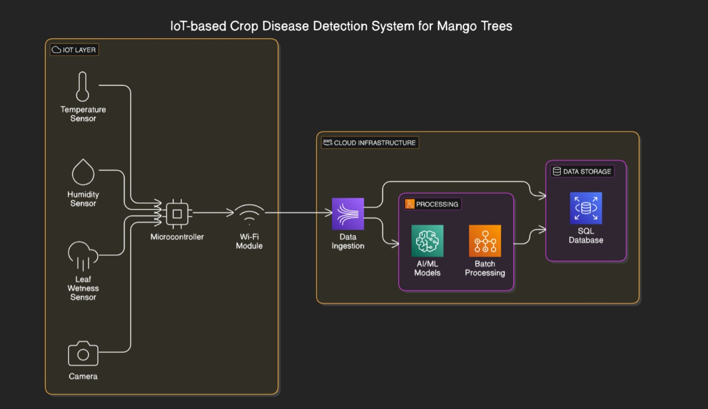

# 24CYS333 - Internet of Things
  
 
    

## IoT#16 - IoT-based Crop Disease Detection System for Mango trees
       
    
 
---

### Problem Statement

The project aims to design and develop an IoT-based model that collects real-time sensor data from crop fields and uploads it to the cloud. This data is analyzed using machine learning techniques on the cloud to make accurate and efficient decisions, thereby improving processing speed and reducing device complexity compared to similar architectures. The model will detect crop diseases and provide recommendations for the best pesticides to assist farmers in improving crop yield.

---
### Hardware Requirements
| Component                          | Functionality                                                                                   |
|------------------------------------|----------------------------------------------------------------------------------------------- |
| Arduino Board                      | Acts as the central microcontroller for data collection and transmission.                      |
| Temperature Sensor (e.g., LM35, DHT22) | Monitors ambient temperature to provide environmental data for analysis.                   |
| Humidity Sensor (e.g., DHT22)      | Measures air moisture levels to monitor environmental conditions.                              |
| Color Sensor (e.g., TCS3200)       | Detects variations in leaf color, which can indicate plant diseases or stress.                |
| Leaf Wetness Sensor (e.g., LWS-02) | Identifies the presence of water on leaves, important for monitoring plant health.            |
| Wi-Fi Module (e.g., ESP8266 or ESP32) | Enables data transmission to a server or cloud platform for remote monitoring.               |
| Battery                            | Provides uninterrupted power, such as a rechargeable lithium-ion battery.                     |

### Software Requirements
| Component            | Functionality                                                                                 |
|----------------------|--------------------------------------------------------------------------------------------- |
| Arduino IDE          | Used for programming the Arduino board and uploading the code.                              |
| Hardware Programming | Written in Arduino C/C++ for controlling sensors and modules.                               |
| Python               | Used for server-side logic and communication with hardware devices.                         |
| MySQL Database       | Stores sensor data and logs for analysis, ensuring data persistence and accessibility.      |

---
### Literature Survey on Mango Crop Disease Detection

This study explores the use of IoT technology to detect and control mango crop diseases, ensuring improved yield and quality. 

1. Key Diseases and Control:
   - Powdery Mildew: White fungal growth on leaves and fruits; controlled with fungicides like tridemorph.
   - Anthracnose: Black spots and fruit rot in humid conditions; managed by pruning and carbendazim sprays.
   - Dieback: Drying of branches; treated with copper oxychloride.
   - Phoma Blight: Yellow lesions on leaves; controlled by benomyl sprays.
   - Bacterial Canker: Water-soaked lesions on leaves and fruits; treated with streptocycline.
   - Sooty Mold: Black fungal coating due to insect secretions; managed by pruning and sprays.
   - Diplodia Stem-End Rot: Affects fruit stems; controlled with carbendazim dips.

2. IoT Application:
   - Sensors like temperature, humidity, and color detect early signs of diseases.
   - Automated monitoring reduces losses and promotes sustainable farming.

3. Impact:
   - IoT enables precise disease management, enhancing productivity and minimizing agricultural losses. 

This approach offers a cost-effective and efficient solution for mango disease management.

---
### Proposed Solution

Developing an IoT-based Crop Disease Detection System that leverages smart sensors, real-time monitoring, and cloud integration to identify and track crop diseases efficiently.
     The system utilizes environmental sensors (humidity, temperature, soil moisture, and leaf wetness) and imaging devices to collect data continuously from the field.
     Machine learning models analyze the collected data to detect early signs of diseases, enabling farmers to take timely preventive actions.
     Integration of real-time tracking and automated alerts via mobile/web interfaces ensures timely updates for farmers.
     Maintenance includes periodic sensor calibration and health monitoring to ensure reliability.

---
### Architecture Diagram

---
### Deliverables

1.Mobile App: Capturing the photos of mango crops

2.Fixed Sensors: Temperture/Humidity Sensors,Leaf Wetness Sensors on the Location around the crop

---
### Use Cases

  ✅ 1.Early Disease Detection:The early alert system for detecting the diseases in
 mango trees uses sensors and image analysis to spot the diseases at very early
 stages and prevent large losses of the crop.
 
 ✅  2.Automated Monitoring: Continuously tracks environmental conditions like
 humidity, temperature, and soil moisture to detect disease-prone conditions.
 
  ✅ 3.Precise Treatment:Precision Treatment gives near perfect recommendations
 for pesticides and fertilizers, avoiding violations of unnecessary chemical use
 and improving yield
 
---   
### Mapping the Project to Relevant Sustainable Development Goals (SDGs) 

| SDG                             | Contribution                                                                                   |
|---------------------------------|-----------------------------------------------------------------------------------------------|
| **SDG 1: Zero Hunger**          | By improving early detection and prevention of crop diseases, the project supports sustainable agriculture, increases food production, ensures food security, and reduces hunger. |
| **SDG 2: Good Health and Well-being** | Healthier crops lead to higher quality and safer food, preventing health risks associated with consuming infected crops.                |
| **SDG 13: Climate Action**      | Promotes sustainable agriculture and reduces crop loss, contributing to climate resilience and minimizing environmental impact.        |

---

### Reference

- Praveen, G. N., & Shashidhar, D. **IoT Based Crop Disease Detection** . RV College of Engineering.[GitHub]
- Gawande, A. R., & Sherekar, S. S. (2023, May). **Analysis of crop diseases using IoT and machine learning approaches**. In International Conference on Applications of Machine Intelligence and Data Analytics (ICAMIDA 2022) (pp. 78-85). Atlantis Press. 

