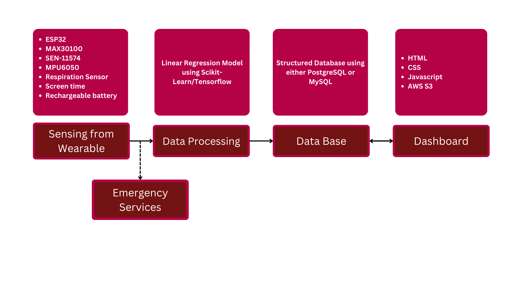

# 24CYS333 - Internet of Things
  
 
    

## IoT#20 -  IoT-Enabled Sleep Monitoring System for Analyzing Sleep Patterns

       
   
 
---
### Problem Statement
Elderly individuals often face challenges in maintaining healthy sleep patterns, which are critical for overall well-being. Monitoring sleep quality and health parameters in real-time is essential for early detection of potential health issues and ensuring timely intervention. However, there is a lack of accessible and user-friendly systems that can track sleep patterns, estimate sleep quality, and provide actionable insights while also offering emergency support in case of sudden anomalies in health metrics like heart rate. We plan to develop an Elderly Sleep Monitoring System that analyzes sleep patterns by estimating REM sleep from heart rate data, evaluates sleep quality, and maintains a detailed record of sleep parameters. The system will provide monthly updates and an intuitive dashboard to visualize these metrics. Additionally, it will include a feature to contact emergency services in case of abrupt heart rate anomalies to ensure safety and prompt medical attention.

---
### Hardware Requirements

| Sensor                          | Specification                       | Purpose                              |  
|-------------------------------- |------------------------------------ |--------------------------------------|  
| Heart Rate Sensor               | MAX30100 or MAX30102                | Measuring heart rate using PPG       |   
| Wearable Housing                | Device band                         | Providing portability and comfort    |  
| Power Supply                    | Rechargeable lithium-ion batteries  | Powering the wearable device         |  
| Gyroscope                       | MPU6050                             | Detecting orientation and movement   |  
| Display                         | LED display                         | Providing visual feedback to users   |  

---
### Literature Survey  

#### Existing Solutions  

Current methods addressing sleep monitoring and health status tracking include:  
- Polysomnography (PSG): The gold standard for sleep measurement, conducted in specialized laboratories with multiple sensors and cables. Despite its accuracy, PSG is intrusive, requires patients to remain in one posture overnight, and disrupts natural sleep patterns.  
- IoT-Based Sleep Monitoring: Emerging systems present non-intrusive, inexpensive, and portable alternatives for remote health monitoring. These solutions leverage IoT.

#### Research Gaps  
1. Intrusiveness of Current Methods: Existing gold-standard techniques like PSG are cumbersome and impractical for daily or long-term use due to their setup complexity.  
2. Lack of Wearable Integration: Few IoT-based solutions incorporate wearables that focus on indirect sleep monitoring metrics, such as REM detection through heartbeat tracking.  
3. Backup Mechanisms: Limited efforts include respiratory monitoring as a secondary layer for ensuring robust sleep abnormality detection.  
---

### Proposed Solution 

##### Use Cases
Use Case 1: ✅  
 Input: Continuous heart rate monitoring  
 Processing: AI detects abnormal spikes or dips  
 Output: Alert sent to caregiver  
 Alert Example: "Heart rate spike detected at 1:30 PM (150 BPM).  

 Use Case 2:  
 Input: Continuous heart rate monitoring  
 Processing: Heart rate remains stable and above threshold  
 Output: Good Sleep, High Sleep Index  
 Alert Example: "User had Good Sleep"  

 Use Case 3:  
 Input: Continuous heart rate monitoring.  
 Processing: Heart rate was irregular and frequent motion was detected   
 Output: Bad Sleep, Low Sleep Index  
 Alert Example: "User did not have Adequate Sleep"   

##### Architectural Diagram

##### Deliverables
1. Wearable Device : A wearable wrist device that will sense necessary parameters
2. Web Application : A Dashboard to provide all necessary data to users in understandable, non-medical terms.
---

### Mapping the Project to Relevant Sustainable Development Goals (SDGs) 
| SDG | Alignment |
|:---|:----------|
| Goal 03 - Good Health and Well-being | The project helps users identify potential sleep disorders (e.g., insomnia, sleep apnea), detect irregularities in heart rate or breathing, and promote healthy sleep hygiene |
| Goal 09 - Industry, Innovation, and Infrastructure |  By utilizing IoT technology to analyze sleep patterns, the system demonstrates innovation in the intersection of healthcare and technology |

### Collaboration 
| Team | Module & Scope |
|:----:|:---------------|
| [IoT#11](https://github.com/Amrita-TIFAC-Cyber-Blockchain/24CYS333-Internet-of-Things/tree/main/Assets/Projects/IoT11) |  Elderly Monitoring System with Fall Detection and Emergency Alert Mechanism | 
---

## References

Thinakaran, K., Baskar, V. V., Shariff, M. A., Chervith, M., Raghavendra, G., & Velmurugan, S. (n.d.). IoT-enabled sleep monitoring wearables: Advancements in tracking and analysis. *[2nd International Conference on Computer, Communication and Control (IC4) (pp. 1-5). IEEE.]*.  

Ali, S., & Parveen, S. (2023). IoT-based smart healthcare monitoring system: A prototype approach. *[Intelligent Communication Technologies and Virtual Mobile Networks: Proceedings of ICICV 2022 (pp. 441-452). Singapore: Springer Nature Singapore.e]*.  

Karthika, K., Mishra, N., Dhanalakshmi, S., Sasikala, S., Murthy, S. M., & Murugan, S. (2023). Raspberry Pi-enabled wearable sensors for personal health tracking and analysis. *[International Conference on Self Sustainable Artificial Intelligence Systems (ICSSAS) (pp. 1254-1259). IEEE.]*.
