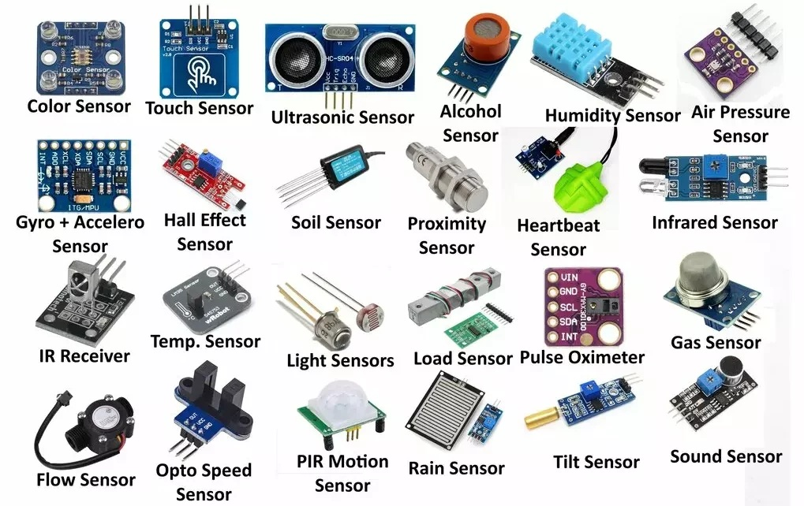

# 24CYS333 - Internet of Things
  
 
    
   

  

## Popular Sensors 

| **Sensor Type**                | **Popular Examples/Parts**                                                                                      |
|--------------------------------|------------------------------------------------------------------------------------------------------------------|
| **Temperature Sensors**          | LM35, DS18B20, TMP36, SHT20, AHT20, LM335, PT100s                                                               |
| **Proximity Sensor**             | LJ12A3, VL53L0X, E18-D80NK, TCRT5000, PR12-2DN, CR18-8DN                                                        |
| **Ultrasonic Sensor**            | HC-SR04, MB1040, US-100, A02YYUW, MB1001, MB7052, URM09, URM-37                                                 |
| **Pressure Sensor**              | BMP280, MPX5010, HX711, HX701B, WPAH01, MPX10DP                                                                 |
| **Hall Effect Sensor**           | A3144, SS495A, OH090U, DRV5032, WSH49E, AH180                                                                   |
| **Load Cell**                    | DYMH-103, SEN-10245, TAL220, TAL221, YZC-133, YZC-131                                                           |
| **Light Sensor**                 | BH1750, LDR (Light Dependent Resistor), TSL2561                                                                 |
| **Color Sensor**                 | TCS34725, TCS3200, ADJD-S311, TEMT6000, TSC34725, TSL25911                                                      |
| **Touch Sensor**                 | TTP223, TTP224, TTP226, TTP229, MPR121, MTCH101, CAP1298, CAP1203, AT42QT1012                                   |
| **Tilt Sensor**                  | RPI-1031, SW-520D, SW420, AT407                                                                                |
| **PIR Motion Detector**          | HC-SR501, HC-SR505, AM312, ZRD-09, D203S, EKMB1306112K                                                          |
| **Vibration Sensor**             | SW-420, SW18020P, ADXL345, 801S, TPSW-200M                                                                      |
| **Accelerometers & Gyroscope**   | MPU-6050, ADXL345, LSM9DS1, MPU9250, ADXL356, MPU6500                                                           |
| **Metal Detector**               | A88, LJ12A3                                                                                                    |
| **Water Flow Sensor**            | YF-S201, FS300A, G1/2 Water Flow Sensor, SEN-HC21WI, SEN-HCG1WA, YF-DN50, YF-S401                               |
| **Heartbeat Sensor**             | MAX30100, MAX30102                                                                                             |
| **Flow and Level Sensor**        | XKC-Y25, XKC-Y25, FS-IR02, P43, YW517B1                                                                        |
| **Gas and Alcohol Sensor**       | MQ-2, MQ-3, MQ-4, MQ-5, MQ-6, MQ-7, MQ-8, MQ-9, MQ-131, MQ-135, MQ-136, MQ-137, MQ-138, MQ-214                  |
| **Humidity and Moisture Sensor** | DHT11, DHT22, Soil Moisture Sensor (Capacitive/Resistive), AHT-25, SHT20                                       | 

_Source:_ Components101.com
